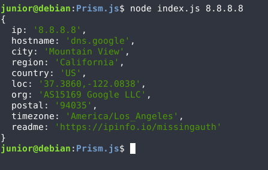

# Prism.js

Prism.js é um script básico feito em JavaScript, que utliziando o pacote [ipinfo](https://www.npmjs.com/package/ipinfo) consegue a partir de um certo IP, mostrar informações aproximadas, como país, cidade, estado, geo-localização entre outraos...

A função do script é bascimente validar se o ip passado por parametro é valido e caso positivo, mostrar as informações sobre o mesmo.

## Instalação
Você precisa do pacote ipinfo para o script funcionar, para adiciona-lo simplesmente use o npm:

`npm add ipinfo`

## Uso
`node index.js <ip>`

Nesse exemplo o comando dado foi: `node index.js 8.8.8.8`

